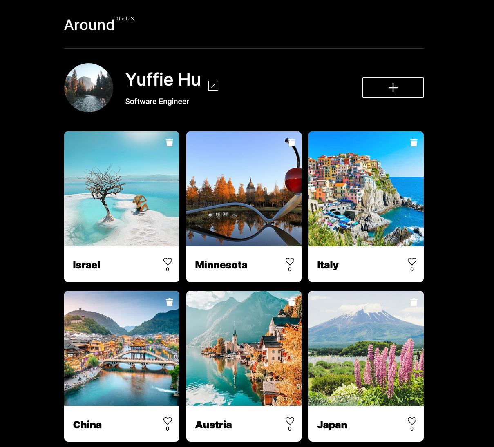

# Project 4: Around The U.S.

An Instagram-like app that displays user's pictures and places, with functionality to like, delete, and custimize.

## Features of the Web App

1. React Functional Components with Hooks
2. Make API calls to the server for pulling and pushing all data on the website
3. Form Validation using React hooks
4. Loading UI
5. Add, Delete, Edit, Like interactions with cards and profiles

## Technologies and Standards Used

- JSX
- CSS
- JavaScript
- React
- Asynchronous Programming
- API
- Node

- JavaScript: frontend interactivity and functionality

- React: React is a free and open-source front-end JavaScript library for building user interfaces based on UI components

- Node.js is an open-source, cross-platform runtime environment that allows developers to create all kinds of server-side tools and applications in JavaScript.
- Node. js is primarily used for non-blocking, event-driven servers, due to its single-threaded nature.
- It's used for traditional web sites and back-end API services.

## Design

**Figma**

- [Link to the project in Figma](https://www.figma.com/file/SurN1jaeEQIhuZEDMhmWWf/Sprint-4-Around-The-U.S.-desktop-mobile?node-id=0%3A1)

## Live Demo

Enjoy the live demo [here](https://yuff1006.github.io/Around_the_US_React/).
